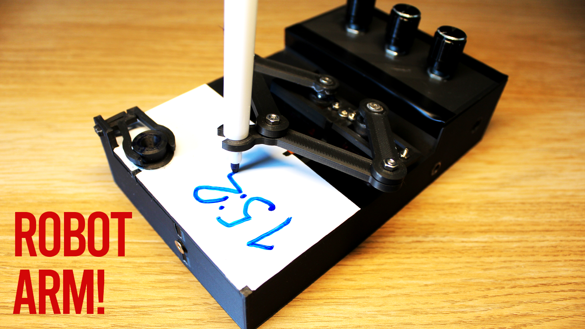
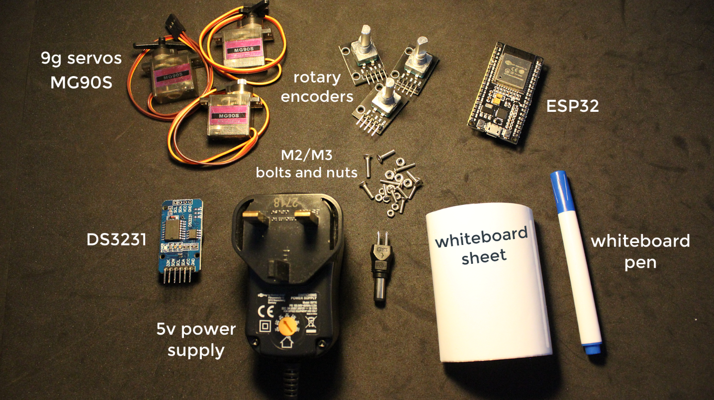
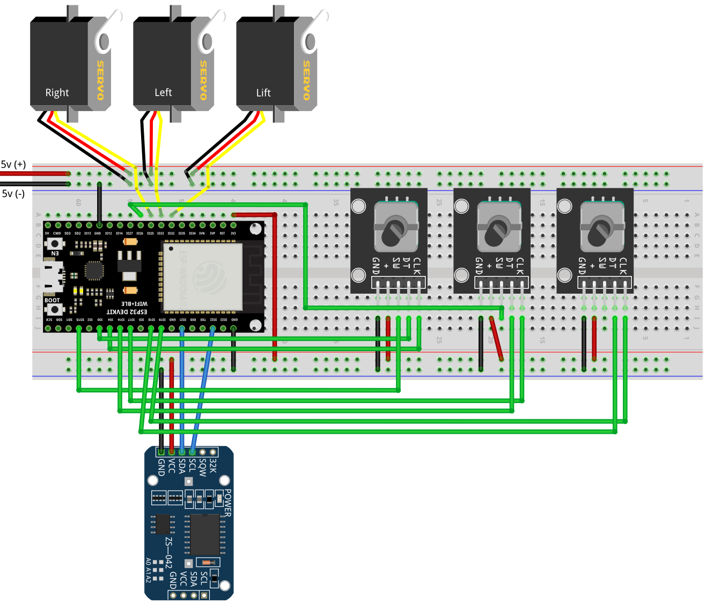

# Plot Clock

There is a [video](https://youtu.be/s5AP7tbfueg) associated with this repo, I highly recommend you watch it if you are going to use this repo.

Please note, the original idea of this robot is by Joo, which can be found [here](https://www.thingiverse.com/thing:248009).

# Components needed

# Wiring

# How to use (`/PlotClock`)

- First you need to install these libraries:
    - `ESP32Servo`, `Encoder`, `DS3231`, `Button`.
    - They can be installed directly from the Arduino library manager.
- Ensure the servo and rotary pin numbers match your connections.
- Once you have chosen the correct pin numbers, upload the code.
- The robot arm needs to make 90 degree movements. Please refer to the video to see exactly how to calibrate the robot arm.
- Once calibrated, change the `currentMode` variable to 1 (or press left most encoder), which will turn it to manual control where you can control the arms using the three rotary encoders.
- Check if everything is working properly. Once you the robot is making expected movements, then press the left most encoder and it will go to automatic mode(2) where it will erase and draw the time every minute.
- If any of this is not clear, I highly recommend watching the video.

## Real-time clock (RTC) calibration

- Keep in mind, you also need to calibrate the real time clock. To do this, open up the `DS3231 > DS3231_set` example in the Arduino IDE.
- Upload the code.
- Once uploaded, open up the serial monitor and enter the date and time in this format `YYMMDDwHHMMSSx` and press enter.
    - For example `210602w174612x`.
- Now your RTC is calibrated, and as long as you have the coin battery attached, it will keep track of the time.

# 3D printed parts

Please refer to the `/3d_models` directory.

# Assembly

To easily see how all parts fit together, please preview the `3d_models/plotclock_model.skp` file.